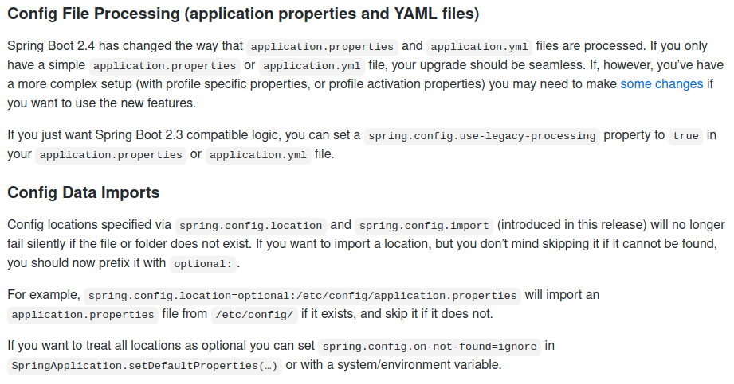

---

스프링 부트 2.4([https://github.com/spring-projects/spring-boot/wiki/Spring-Boot-2.4-Release-Notes](https://github.com/spring-projects/spring-boot/wiki/Spring-Boot-2.4-Release-Notes)) 출시노트를 살펴보면 인상적인 2가지가 있다.



> 애플케이션 구성파일(application.yml 혹은 application.properties)의 작동방식이 변경되었다.

---

# 구성파일 불러오기

- 다른 구성파일을 직접 불러와 사용할 수 있다.
    - 지정한 디렉터리나 파일이 없어도 `spring.config.location` 과 `spring.config.import` 을 이용하여 구성파일 위치를 정의할 수 있다. 바로 `optional:` 이라는 접두사를 사용하면 된다.
        - 예: `spring.config.location: optional:/etc/config/application.yml`
    - `optional:` 을 사용하기 싫다면(== 모든 구성파일 경로에 대해 `optional:` 을 적용하고 싶다면) `spring.config.on-not-found: ignore` 를 이용하면 된다.

이 기능은 구성파일을 작성하는 방법을 변경할 수 있다. 기존에는 `application-{profile}.yml` 형식으로 작성해야 `Environment` 에 적재되어 선언된 프로파일로 선언해야 사용가능했다.

```
//application-honeymon.yml
honeymon:
  root-uri: http://honeymon.io
  github: https://github.com/ihoneymon

//application.yml
spring.profiles:
  include:
    - honeymon

// 이랬는데!!
```

다음과 같은 형식이 되어 굳이 `application-honeymon.yml` 형식을 고수할 필요가 없어졌다.

```
//honeymon.yml
honeymon:
  root-uri: http://honeymon.io
  github: https://github.com/ihoneymon

//application.yml
spring.config:
  location: classpath:honeymon.yml
```

# 변경된 구성파일 처리방식

## 스프링 부트 2.4 이전

YAML 에서는 구분자(`---`)를 이용해서 문서를 구분짓는다. 파일 하나에서 구분자(—-)를 이용해서 문서를 여러 문서를 작성할 수 있다. 스프링 부트에서는 이를 활용하여 `spring.profiles: {profile}`: 로 활성화되는 **프로파일**에 맞춰 애플리케이션 속성 정의문서를 작성할 수 있도록 했다.

스프링 부트 2.3.에서는 이 프로파일 선언선수에 따라 정의속성에 대한 덮어쓰기를 수행했다.

이런 방식이 스프링 부트 2.4 부터 변한다.

## 스프링 부트 2.4+

- [https://docs.spring.io/spring-boot/docs/current/reference/html/spring-boot-features.html#boot-features-external-config-files](https://docs.spring.io/spring-boot/docs/current/reference/html/spring-boot-features.html#boot-features-external-config-files)

### Java properites file(`*.properties`) YAML 과 유사한 문서구분자 지원

Java properties 파일에서도 YAML 에서 문서를 구분짓는 구분자(`---`)와 유사한 구분자(`#---`) 를 이용할 수 있다.

```
test=value
#---
spring.config.activate.on-profile=dev
test=overridden-value
```

### 간단한 애플리케이션은 신경쓰지 않아도 된다.

- 구성파일(`application.yml` 혹은 `application.properties`) 하나만 사용하는 경우
- `spring.profiles<.*>` 속성을 사용하지 않는 경우
- 다중문서 YAML 파일을 사용하지 않는 경우

> 나는 간단한 애플리케이션만 만드는 건 아니라고!!

### 이런 방식은 더 이상 유효하지 않다.

```
//application-honeymon.yml
honeymon:
  root-uri: http://honeymon.io

---
spring.profiles: develop
honeymon:
  root-uri: http://honeymon.develop.io

---
spring.profiles: beta
honeymon:
  root-uri: http://honeymon.beta.io
```

이걸 불러오면.

```
//application.yml
spring.profiles:
  include:
    - honeymon
```

> `spring.profiles` 속성은 Deprecated 대상이 되었다.
끼야아아악!!! 안되나 하고 찾아보다가 deprecated 된 것을 발견하고, 2.4.1 이상 업뎃하기 전에 언능 바꿔야겠다.


### 이제 `spring.config.activate.on-profile` 을 사용하자!!

스프링 부트 2.4 부터는 YAML 파일 하나에 구분자(`---`)로 문서를 나누고 `spring.profies` 로 구분짓는 문서작성방식이 더이상 유효하지 않다(`spring.profiles` deprecated).

`honeymon.yml`

```
honeymon:
  nick-name: Honeymon

---
spring.config.activate.on-profile: honeymon-develop
honeymon:
  nick-name: Developer Honeymon

---
spring.config.activate.on-profile: honeymon-beta
honeymon:
  nick-name: Beta tester Honeymon
```

위 구성파일을 다음과 같이 읽어들인다.

```
spring:
  config:
    import: classpath:honeymon.yml
  profiles:
    include:
      - honeymon
    group:
      develop: honeymon-develop
      beta: honeymon-beta

```

다음 형식으로 테스트를 수행해봤다.

```
@SpringBootTest
class HoneymonPropertiesTest {
    @Autowired
    HoneymonProperties honeymonProperties;

    @Test
    @DisplayName("프로파일을 선언하지 않았다면!!")
    void test01() {
        assertThat(honeymonProperties.getRootUri()).isEqualTo("http://honeymon.io");
        assertThat(honeymonProperties.getNickName()).isEqualTo("Honeymon");
    }
}
```

스프링 부트 2.4 이전에는, 프로파일을 선언하지 않으면 `application.yml` 을 비롯해서 `default` 프로파일(YAML 파일 구분자(`---`) 로 구분되는 첫번째 문서)을 사용했다. 그러나 스프링 부트 2.4 에서는 제일 마지막 문서로 덮어쓰써 버린다.

위에서 `[spring.profies.group](http://spring.profies.group)` 을 이용해서 **그룹프로파일(`spring.profiles.group.{group-name}`)**을 선언하면 내가 의도했던 대로 속성값을 덮어쓴다.

```
spring:
  profiles:
    group:
      develop: honeymon-develop
      beta: honeymon-beta
```

`HoneymonPropertiesDevelopTest.java`

```
@SpringBootTest
@ActiveProfiles({"develop"}) // spring.config.activate.on-profile: honeymon-develop 활성화
class HoneymonPropertiesDevelopTest {
    @Autowired
    HoneymonProperties honeymonProperties;

    @Test
    @DisplayName("develop 프로파일 정의")
    void test01() {
        assertThat(honeymonProperties.getRootUri()).isEqualTo("http://honeymon.develop.io");
        assertThat(honeymonProperties.getNickName()).isEqualTo("Developer Honeymon");
    }
}
```

`HoneymonPropertiesBetaTest.java`

```
@SpringBootTest
@ActiveProfiles({"beta"}) //spring.config.activate.on-profile: honeymon-beta
class HoneymonPropertiesBetaTest {
    @Autowired
    HoneymonProperties honeymonProperties;

    @Test
    @DisplayName("beta 프로파일 선언")
    void test01() {
        assertThat(honeymonProperties.getRootUri()).isEqualTo("http://honeymon.beta.io");
        assertThat(honeymonProperties.getNickName()).isEqualTo("Beta tester Honeymon");
    }
}
```

> 주의사항!!
`spring.profiles` 속성이 제거되면 스프링 부트 2.4 부터는 YAML 내에 있는 문서구분을 무시하고 마지막 문서에 있는 속성으로 덮어쓴다.

## 주의사항

> YAML 파일 마지막 문서에서 `spring.config.activate.on-profile` 선언하는 것을 빼먹지 말자. 빼먹으면 프로파일 선언도 안먹고 마지막 속성값으로 덮어쓴다.

`missing-on-profile.yml`

```
app.duration-field: 5s

---
spring.config.activate.on-profile: filter
app.duration-field: 5m

---
#이렇게 해놓으면 위에 spring.config.activate.on-profile 선언도 안통한다. @_@);;;
app.duration-field: 5h
```

`application.yml`

```
spring:
  config:
    import: classpath:honeymon.yml, classpath:missing-on-profile.yml
  profiles:
    include:
      - honeymon
    group:
      develop: honeymon-develop
      beta: honeymon-beta

---
app.name: Spring Config Data Migration guide

---
app.name: Override Spring Config Data Migration guide

---
### 프로파일 선언 없이 사용하는 상황이 벌어지지 않길 바란다!!
app.name: Override Override Spring Config Data Migration guide
```

`AppPropertiesFilter.java`

```
@ActiveProfiles({"filter"})
@SpringBootTest
class AppPropertiesFilterTest {
    @Autowired
    AppProperties appProperties;

    @Test
    void test() {
        assertThat(appProperties.getName()).isEqualTo("Override Override Spring Config Data Migration guide");
        //Duration.ofMinutes(5) 이길 기대했는데....
        assertThat(appProperties.getDurationField()).isEqualTo(Duration.ofHours(5L));
    }
}
```

# 정리

- 스프링 부트 2.4 부터 변경된 구성파일 처리방식이 마음에 들지 않는다면, `spring.config.use-legacy-processing: true` 를 선언하자. 그럼 마음이 편안해진다. 그러나 `spring.profiles` 는 곧 제외될 속성이다. 마음이 불편해진다. 된장.
    - `spring.config.use-legacy-processing: true` 을 선언하면 기존방식으로 작동한다.
        - 작동하긴 개뿔. @_@);; 아예 적재가 안되는 것 같은데...?
- 스프링 부트 2.4 는 활성화되는 프로파일 순서보다 문서의 순서가 더욱 중요하다.
    - **마지막에 활성화된 프로파일 문서가 모든 걸 덮어쓴다**. 마지막에 웃는 자가 진짜 승리자?
- 스프링 부트 2.4 부터는 `spring.config.activate.on-profile` 을 통해서 프로파일 활성화시 사용할 속성을 정의할 수 있다.
- 스프링 부트 2.4 부터는 `[spring.profiles.group.{group-name}](http://spring.profiles.group)` 을 이용해서 그룹에 작성한 프로파일을 활성화할 수 있다(프로파일 활성화전략 1은 2.4 작동방식을 예전에 쓰던 방식에 맞춘 것).
    - 예: `spring.profiles.group.develop: honeymon-develop, toast-client-develop`
    - **프로파일 활성화전략 1**: 이전에 사용하던 방식대로 `application-{profile}.yml` 은 모듈에서 사용하는 프로파일 문서로 사용하고 내부에 `spring.config.activate.on-profile` 을 실행환경(local,develop,beta,prod)으로 구분지어 사용하는 할 수 있다.

      `application-honeymon.yml` → honeymon 모듈로 치고

        ```
        honeymon:
          nick-name: Honeymon

        ---
        spring.config.activate.on-profile: develop
        honeymon:
          nick-name: Developer Honeymon

        ---
        spring.config.activate.on-profile: beta
        honeymon:
          nick-name: Beta tester Honeymon
        ```

      `application.yml`

        ```
        spring.profiles:
          include:
            - honeymon
        ```

      다음과 같이 실행된다.

        ```
        java -jar spring-boot-2-4-config-data-migration-0.0.1-SNAPSHOT.jar --spring.profiles.active=develop

          .   ____          _            __ _ _
         /\\ / ___'_ __ _ _(_)_ __  __ _ \ \ \ \
        ( ( )\___ | '_ | '_| | '_ \/ _` | \ \ \ \
         \\/  ___)| |_)| | | | | || (_| |  ) ) ) )
          '  |____| .__|_| |_|_| |_\__, | / / / /
         =========|_|==============|___/=/_/_/_/
         :: Spring Boot ::                (v2.4.1)

        2021-01-16 09:44:16.720  INFO 43578 --- [           main] ringBoot24ConfigDataMigrationApplication : Starting SpringBoot24ConfigDataMigrationApplication using Java 11.0.2 on honeymon-desktop with PID 43578 (/home/honeymon/git-repos/spring-boot-2-4-config-data-migration/build/libs/spring-boot-2-4-config-data-migration-0.0.1-SNAPSHOT.jar started by honeymon in /home/honeymon/git-repos/spring-boot-2-4-config-data-migration/build/libs)
        2021-01-16 09:44:16.722  INFO 43578 --- [           main] ringBoot24ConfigDataMigrationApplication : The following profiles are active: develop,honeymon-develop,honeymon
        ```

    - **프로파일 활성화전략 2**: 새로운 처리방식에 맞춰 각 모듈별로 활성화될 프로파일을 선언(`spring.config.activate.on-profile`) 실행환경에 맞춰 정의하고 `application.yml` 파일에서 그룹으로 지정하여 사용할 수 있다.

      `application-honeymon.yml` → honeymon 을 모듈로 치고

        ```
        # 스프링 부트 2.4 이전에는 default 영역으로 인식되었지만,
        # 스프링 부트 2.4 부터는 제일 마지막 정의된 내용으로 덮어씌워진다.
        honeymon:
          nick-name: Honeymon

        ---
        spring.config.activate.on-profile: honeymon-develop
        honeymon:
          nick-name: Developer Honeymon

        ---
        # 프로파일 문서의 순서도 중요하군. +_+)
        spring.config.activate.on-profile: beta
        honeymon:
          nick-name: Beta tester Honeymon 1

        ---
        spring.config.activate.on-profile: honeymon-beta
        honeymon:
          nick-name: Beta tester Honeymon
        ```

      `application.yml`

        ```
        spring:
          config:
            import: classpath:honeymon.yml, classpath:missing-on-profile.yml
          profiles:
            group:
              develop: honeymon-develop # develop
              beta: honeymon-beta # beta
        ```

      그룹프로파일(`spring.profiles.group.{group-name}`)을 사용하여 활성화 하는 방식이다.

    - 각각의 장단점이 있지만 스프링 부트 2.4의 구성파일 처리방식이 허점이 더 많은 느낌이 든다. 사용하다 경험치가 쌓이면 다르게 느끼게 될까?
    - 스프링 부트 2.4 에서 활성화된 프로파일을 살펴보면 `develop,honeymon-develop,honeymon` 식으로 되어 있는데, 스프링 부트 2.4 이전이었다면 `honeymon, honeymon-develop, develop` 으로 적재가 될 것이다. 그래서 마지막에 활성화된 프로파일 부분만 신경쓰면 됐는데 스프링 부트 2.4 에서는 활성화된 프로파일과 관련된 모든 문서를 살펴봐야하는 번거로움이 생겼다.

# 참고

- [https://github.com/spring-projects/spring-boot/wiki/Spring-Boot-2.4-Release-Notes](https://github.com/spring-projects/spring-boot/wiki/Spring-Boot-2.4-Release-Notes)
- [https://github.com/spring-projects/spring-boot/wiki/Spring-Boot-Config-Data-Migration-Guide](https://github.com/spring-projects/spring-boot/wiki/Spring-Boot-Config-Data-Migration-Guide)
- [https://spring.io/blog/2020/08/14/config-file-processing-in-spring-boot-2-4](https://spring.io/blog/2020/08/14/config-file-processing-in-spring-boot-2-4)
- [https://github.com/kwon37xi/research-spring-boot-2.4/tree/master/profile-group?fbclid=IwAR27segJmkpFUo_io80gGo_DJO2pJXQm_h9EtNlv4rLAg-S2vH56f1I7Q84](https://github.com/kwon37xi/research-spring-boot-2.4/tree/master/profile-group?fbclid=IwAR27segJmkpFUo_io80gGo_DJO2pJXQm_h9EtNlv4rLAg-S2vH56f1I7Q84)